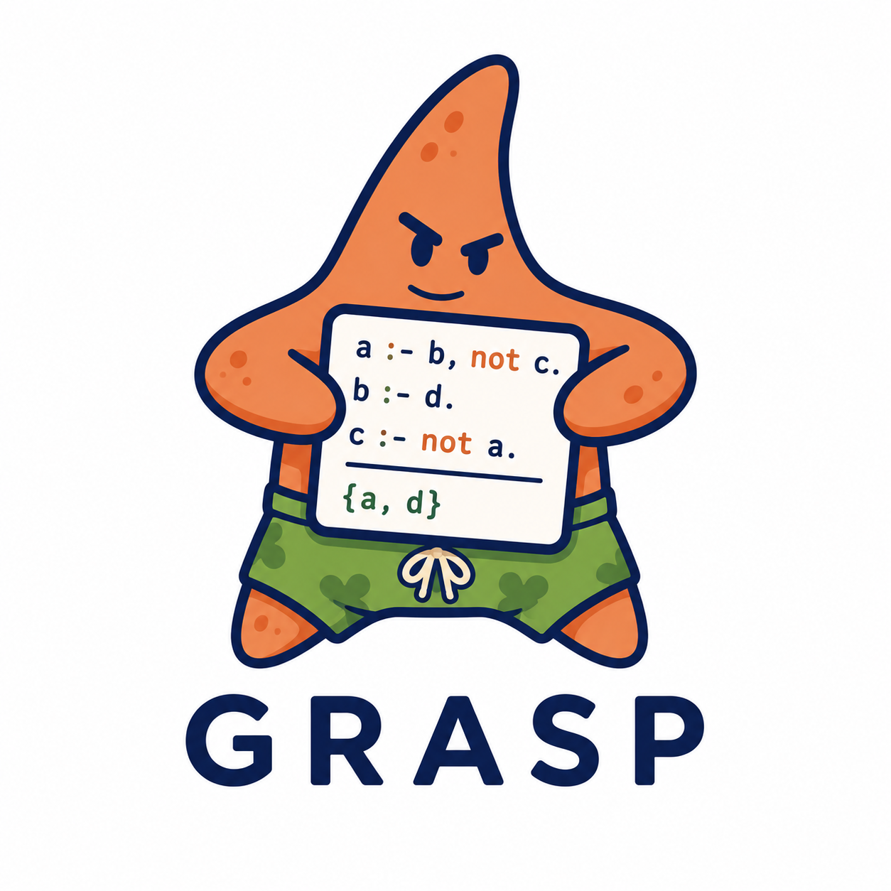

<div align="center">
    
    <h1>GRASP</h1>
    <h3><em>A language to simplify the definition of rule rewritings for Answer Set Programming</em></h3>
</div>

---

## Installation

GRASP requires Python 3.13 or newer.

Run the following in your terminal:

```bash
git clone https://github.com/gianzav/GRASP.git
cd GRASP
python3 -m venv .venv
source .venv/bin/activate
pip install .
```

After installation, the `grasp` command becomes available in the active environment.

## Basic usage

A rewrite rule has the form:

```text
@rulename pattern -> rewriting1. rewriting2.
```

Or, with line breaks:

```text
@rulename pattern ->
    rewriting1.
    rewriting2.
```

Patterns and rewritings use ASP-style rules. Pattern variables begin with `?` and capture matched values from the input rule.

Example rule file:

```text
@swap_head ?head :- ?body. ->
    ?body :- ?head.
```

This rule matches an input rule of the form:

```text
h :- p.
```

and rewrites it to:

```text
p :- h.
```

Rules can be stored in one or multiple files and loaded in the REPL as follows:

## Complete usage

### Rule definitions

A rule begins with `@rulename`, then the pattern to match, then `->`, then one or more rewrite rules.

Example:

```text
@rule1 head :- ?body. ->
    ?body :- head.
```

Rewriting rules can be written on the same line as `->` or in an indented block.

### Pattern variables

Pattern variables start with `?` and capture parts of the matched input.

- `?x` captures a single symbol or atom.
- `?x*` captures a sequence of symbols or atoms separated by commas.
- `?x[;:,]*` captures a sequence separated by custom characters such as `;`, `:`, or `,`. If the separators are specified in square brackets, then only those are considered for matching.

A collection variable preserves its separators exactly when it is inserted into a rewrite.

### Rewriting references

Rewritings can reuse the values captured by pattern variables.

- `?x` inserts the exact matched text.
- `?x'` appends a prime character to the matched symbol.
- `?x/vars` inserts only the ASP variables that occur in the matched object.

Example:

```text
@prime ?atom. ->
    ?atom'.
```

If `?atom` matches `p(1)`, the rewrite becomes `p'(1)`.

The system also supports generated symbols in rewritings. In detail:

- Variables whose name is a number represent new symbols, e.g. `?1` or `?231`. A symbol named `_newN` where `N` is an integer (incremental, starting from 0) is generated.
- Variables with a name in square brackets represent new symbols as well, e.g. `?[foo]`, `?[bar1]`. For a variable `?[foo]`, a new symbol named `_fooN` where `N` is an integer (incremental, starting from 0) is generated.

### Conditional rewritings

The optional `when cond1, cond2, ...` clause makes a rewrite apply only when a condition holds.

- Conditions are separated by commas.
- A condition may be prefixed by `not`.
- Conditions use pattern variables or `/vars` suffixes.

Example:

```text
@choice {?rest*} :- ?body. ->
    {?rest} :- ?body. when ?rest
```

This rule applies the last rewrite only if `?rest` matched a non-empty sequence.

### File loading

The REPL accepts multiple rule files as arguments.

- Comments starting with `%` are removed before parsing.
- Blank lines and indentation are preserved.
- The command can be used with one or more files.

Example:

```bash
grasp -i rules1 rules2
```

### Pattern alternatives

Multiple patterns can be defined for a rule using the pipe character `|`. Take for example:

```text
@rule a. | b. -> c.
```

This rule will match on `a.` and `b.`, producing `c.`. In this way we can compactly represent multiple patterns that share a body.
Patterns are evaluated in the order of definition.

If multiple pattern variables are present, not all of them might match. If a variable is declared in the pattern but doesn't match, then it is treated as "empty string" in the rewritings. The system tries to do a smart rewriting by removing trailing separators in case a pattern variable used in the rewritings has not matched against anything. Take for example the following rule:

```text
@r ?p :- b. | ?p :- ?c, not d. ->
	:- ?p, ?c.
```

Giving `h :- b` as input to GRASP, the rule will match because of the first pattern, and produce as output `:- h`, since there was no match for the variable `?c`.
If instead the input is `a :- b, not d.`, we get `:- a, b` as output, as the second pattern did match and `?c` is bound to `b`.
Variables that don't match against anything are treated as false condition by the `when` keyword. For example:

```
@rule ?p :- q. | ?r :- s. ->
      f. when ?p
      g. when ?r
```

Produces `f.` only when the first pattern matches, and produces `g.` when the second does.

### Runtime behavior

- Rules are applied exhaustively: a matched rule is replaced by its rewrite sequence until no further rewrite is possible.
- If a rule does not match any pattern, it remains unchanged.
- The REPL supports interactive input and a `:rules` command to display the loaded rewrite rules.
